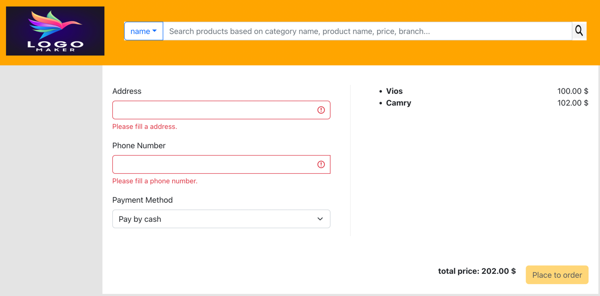

# iCommerce

##Prerequisite
| Env            | Description                |
|----------------|----------------------------|
| MacOS          | version Monterey 12.2.1    |
| JDK            | version 11                 |
| docker         | version 20.10.12 or higher |
| docker-compose | version 1.29.2 or higher   |

## List of components

###Microservices

- gateway
- shopping-product
- shopping-cart

###User Interface

- my-app

###Deployment

- Contain docker-compose.yml and related Dockerfile for correspondent services. 

##Build docker images

- Change mode for script file: `sudo chmod -R 777 build-images.sh`
- Run script file to build whole project, as well as building docker images: `./build-images.sh`
- After building, the deployment folder structure will be as following:


## Run Services

###Docker Compose
is used to run Microservices, Consul and MySQL as multicontainer Docker applications.

- To add the services, run
    - `$ docker-compose up`, or
    - `$ docker-compose up -d [service1, service2, ...]`
- To start the services, run
    - `$ docker-compose start`, or
    - `$ docker-compose start -d [service1, service2, ...]`
- To stop the services _(without deleting states)_, run
    - `$ docker-compose stop`, or
    - `$ docker-compose stop [service1, service2, ...]`
- To remove containers and delete saved states, run
    - `$ docker-compose down -v`

After everything is up,

- Open http://localhost:8500/ui/dc1/services to see the list of running services.


- Open docker application to see list of services being run by docker-compose


###ReactJS

- cd to application folder: `cd ui/my-app`
- To build the application: `npm install`
- To run the application: `npm run`
- List product screen:


- Cart details screen:


- Checkout screen:



## Things to Note

- **MySQL**
  - Create table structure and insert data before starting `shopping-cart` & `shopping product` services.
    - init.sql file will be located in `deployment/mysql/sql/init.sql`
    - Run it using your preferable MySQL Tool (example: MySQLWorkbench).

- **Just In Case**
    - If something goes wrong, you might need to bring down the services, rebuild the images and restart the containers. Just run
      ```
      $ docker-compose down -v
      $ docker-compose build --no-cache
      $ docker-compose up
      ```

## Basic Configurations

- Specify MySQL version in `.env`
- MySQL:
    - `mysql/config/mysql.cnf`
    - Save the config file as _read-only_ or else configurations will fail.
- Refer to `docker-compose.yml` for configurations like username, password, ports, etc.


## API details

<table>
 <tr>
   <td> Service </td>  <td> Request </td> <td> Response </td>
 </tr>
 <tr>
  <td> shopping-product searchAll	 </td>
  <td> curl --location --request POST 'localhost:8802/product-service/product/search' \
--header 'Content-Type: application/json' \
--data-raw '{
}'
	 </td>
  <td>

  ```json
  {
  "status": {
    "code": "000000",
    "message": "Success"
  },
  "data": [
    {
      "createdDatetime": 2022080110103,
      "createdBy": 1,
      "updatedDatetime": null,
      "updatedBy": null,
      "status": true,
      "id": 1,
      "name": "Vios",
      "description": "segment B",
      "price": 100.00,
      "color": "Red"
    },
    {
      "createdDatetime": 2022080110104,
      "createdBy": 1,
      "updatedDatetime": null,
      "updatedBy": null,
      "status": true,
      "id": 2,
      "name": "Camry",
      "description": "segment D",
      "price": 102.00,
      "color": "Black"
    },
    {
      "createdDatetime": 2022080110105,
      "createdBy": 1,
      "updatedDatetime": null,
      "updatedBy": null,
      "status": true,
      "id": 3,
      "name": "530i",
      "description": "petrol car",
      "price": 10.00,
      "color": "Black"
    },
    {
      "createdDatetime": 2022080110107,
      "createdBy": 1,
      "updatedDatetime": null,
      "updatedBy": null,
      "status": true,
      "id": 4,
      "name": "530e",
      "description": "electric car",
      "price": 10.00,
      "color": "Black"
    },
    {
      "createdDatetime": 2022080110110,
      "createdBy": 1,
      "updatedDatetime": null,
      "updatedBy": null,
      "status": true,
      "id": 5,
      "name": "750Li",
      "description": "luxury car",
      "price": 10.00,
      "color": "Black"
    },
    {
      "createdDatetime": 2022080110110,
      "createdBy": 1,
      "updatedDatetime": null,
      "updatedBy": null,
      "status": true,
      "id": 6,
      "name": "Scrambler",
      "description": "scarmbler",
      "price": 10.00,
      "color": "Red"
    },
    {
      "createdDatetime": 2022080110110,
      "createdBy": 1,
      "updatedDatetime": null,
      "updatedBy": null,
      "status": true,
      "id": 7,
      "name": "Monster",
      "description": "monster",
      "price": 15.00,
      "color": "Red"
    },
    {
      "createdDatetime": 2022080110110,
      "createdBy": 1,
      "updatedDatetime": null,
      "updatedBy": null,
      "status": true,
      "id": 8,
      "name": "Hypermotard",
      "description": "hypermotard",
      "price": 25.00,
      "color": "Red"
    }
  ],
  "pagination": {
    "pageCount": 0,
    "pageSize": 0,
    "currentPage": 0,
    "recordCount": 8,
    "sortOrder": null
  }
}
  ```

  </td>
</tr>
 <tr>
  <td> shopping-product searchByCriteria	 </td>
  <td> curl --location --request POST 'localhost:8802/product-service/product/search' \
--header 'Content-Type: application/json' \
--data-raw '{
    "category": "car",
    "name": "5",
    "price": 10,
    "branch": "b",
    "color": "black"
}'
	 </td>
  <td>

  ```json
  {
  "status": {
    "code": "000000",
    "message": "Success"
  },
  "data": [
    {
      "createdDatetime": 2022080110105,
      "createdBy": 1,
      "updatedDatetime": null,
      "updatedBy": null,
      "status": true,
      "id": 3,
      "name": "530i",
      "description": "petrol car",
      "price": 10.00,
      "color": "Black"
    },
    {
      "createdDatetime": 2022080110107,
      "createdBy": 1,
      "updatedDatetime": null,
      "updatedBy": null,
      "status": true,
      "id": 4,
      "name": "530e",
      "description": "electric car",
      "price": 10.00,
      "color": "Black"
    },
    {
      "createdDatetime": 2022080110110,
      "createdBy": 1,
      "updatedDatetime": null,
      "updatedBy": null,
      "status": true,
      "id": 5,
      "name": "750Li",
      "description": "luxury car",
      "price": 10.00,
      "color": "Black"
    }
  ],
  "pagination": {
    "pageCount": 0,
    "pageSize": 0,
    "currentPage": 0,
    "recordCount": 3,
    "sortOrder": null
  }
}
  ```

  </td>
</tr>
 <tr>
  <td> shopping-product searchById	 </td>
  <td> curl --location --request GET 'localhost:8802/product-service/product/search/1' \
--data-raw ''
	 </td>
  <td>

  ```json
  {
  "status": {
    "code": "000000",
    "message": "Success"
  },
  "data": {
    "createdDatetime": 2022080110103,
    "createdBy": 1,
    "updatedDatetime": null,
    "updatedBy": null,
    "status": true,
    "id": 1,
    "name": "Vios",
    "description": "segment B",
    "price": 100.00,
    "color": "Red"
  }
}
  ```

  </td>
</tr>
 <tr>
  <td> shopping-cart add	 </td>
  <td> curl --location --request POST 'localhost:8802/cart-service/cart/add' \
--header 'Content-Type: application/json' \
--data-raw '{
    "productIds": [
        5,
        6,
        8
    ],
    "totalPrice": 1500.6,
    "productQuantity": 3
}'
	 </td>
  <td>

  ```json
  {
  "status": {
    "code": "000000",
    "message": "Success"
  },
  "data": true
}
  ```

  </td>
</tr>
 <tr>
  <td> shopping-cart searchAll	 </td>
  <td> curl --location --request GET 'localhost:8802/cart-service/cart/search'
	 </td>
  <td>

  ```json
  {
  "status": {
    "code": "000000",
    "message": "Success"
  },
  "data": [
    {
      "createdDatetime": null,
      "createdBy": null,
      "updatedDatetime": null,
      "updatedBy": null,
      "status": false,
      "id": 1,
      "productIds": "5,6,8",
      "totalPrice": 1500.60,
      "productQuantity": 3
    },
    {
      "createdDatetime": null,
      "createdBy": null,
      "updatedDatetime": null,
      "updatedBy": null,
      "status": false,
      "id": 2,
      "productIds": "1,2,3",
      "totalPrice": 200.10,
      "productQuantity": 3
    }
  ]
}
  ```

  </td>
</tr>
 <tr>
  <td> shopping-cart searchById	 </td>
  <td> curl --location --request GET 'localhost:8802/cart-service/cart/search/1'
	 </td>
  <td>

  ```json
  {
  "status": {
    "code": "000000",
    "message": "Success"
  },
  "data": {
    "createdDatetime": null,
    "createdBy": null,
    "updatedDatetime": null,
    "updatedBy": null,
    "status": false,
    "id": 1,
    "productIds": "5,6,8",
    "totalPrice": 1500.60,
    "productQuantity": 3
  }
}
  ```

  </td>
</tr>
</table>